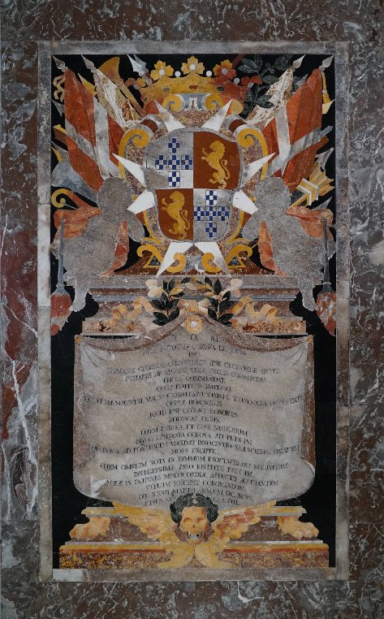
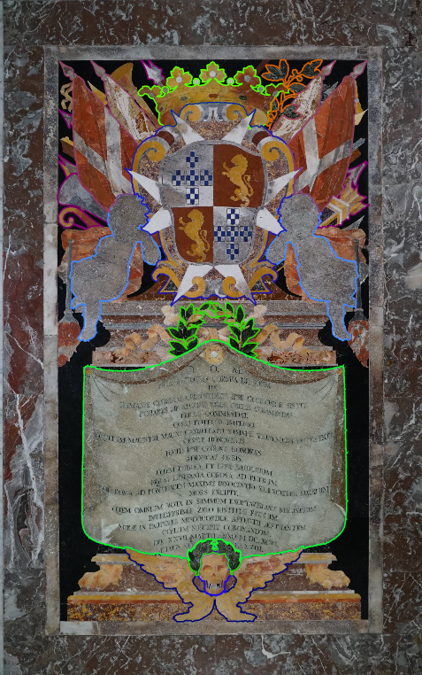

# Data Annotation

## News Video Segmentation

- Clearly indicate which video you annotated by writing the email address you used for login and the video annotation ID.
  - I annotated the video ID 6 with the email address florent.cadet.24@um.edu.mt.

- Describe the segmentation process and what details you focused on.
  - I segment and annotate the video with a web application ([http://nbxai.research.um.edu.mt/projects/1/data?tab=1&task=6](http://nbxai.research.um.edu.mt/projects/1/data?tab=1&task=6)), in the process I review the video checking if it's a studio, story, commercial, transition or visualization. I find the end of the segment roughly by moving the video's playback cursor, then with `alt + arrow` I can go frame by frame to get more precision, then when the end of the section is found, note it down then start again with another.

- Discuss any challenges or unexpected aspects of the video content
  - The video is a little long (50 minutes), so it took a long time to go through it all. The action is quite simple, but very long and repetitive, so it was a bit boring to go through it all.

I wanted to continue my annotation work, but I can no longer access the website, I get an Access Denied page. I've tried logging out and logging in, but I still get the Access Denied page. So I've only annotated about 2/3 of the video (~30 minutes out of the 50 minutes).

## News Website Eye-Tracking

- Explain how it felt to have your eye movements monitored.
  - I've tested eye-tracking software before, my brother and I have one and have already done a few tests with it, but it's always very interesting to see how they can track your eyes.
- Did this experience alter how you usually interact with news sites?
  - I think it's a very interesting tool to see how people interact with the news site, but I don't think it will change my behavior.

## Tombstone Annotation

- Include a screenshot of the annotated image in the report together with the image ID.
  - I work on the Image ID 126

| Tombstone ID 126| Tombstone Annotated ID 126|
|:-:|:-:|

- Share your initial reaction to this project.
  - I think it's a very interesting project, but from my point of view, it's not something I'd use.

- What kinds of information did you annotate? Were there difficulties ?
  - I didn't have any difficulties, it's just very time-consuming to make lots of stitches all around the shape, so it's very time-consuming and repetitive.

- Did this project change your views on St John's Co-Cathedral ?
  - No, nothing has changed in my view of St John's Co-Cathedral.
